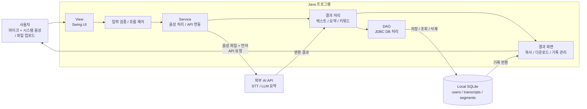
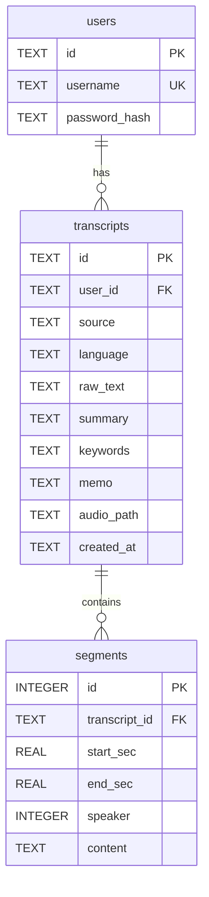

# 1. 요구사항 분석 및 설계

## 1.1 요구사항 정의

### 기능적 요구사항

| ID | 기능 | 담당 | 우선순위 |
| --- | --- | --- | --- |
| F-01 | 실시간 녹음·입력 장치 선택 | 민건영 | 높음 |
| F-02 | 로컬 오디오 파일 업로드 | 민건영 | 높음 |
| F-03 | 커스텀 STT API 통신 모듈 | 민건영 | 높음 |
| F-04 | 설정·구성 관리(API 키 등) | 민건영 | 낮음 |
| F-05 | 비동기 처리·프로그레스 바 | 민건영 | 높음 |
| F-06 | 회원가입·로그인 | 정의영 | 높음 |
| F-07 | 로컬 SQLite DB 연동 | 정의영 | 높음 |
| F-08 | 좌측 히스토리 패널 | 정의영 | 중간 |
| F-09 | 우클릭 컨텍스트 메뉴 | 정의영 | 중간 |
| F-10 | TXT 내보내기 | 정의영 | 중간 |
| F-11 | DOCX·SRT 내보내기 | 정의영 | 중간 |
| F-12 | STT 원문 편집 | 정의영 | 중간 |
| F-13 | 핵심 요약 | 민건영 | 중간 |
| F-14 | 주요 키워드 추출 | 민건영 | 중간 |
| F-15 | 실시간 통합 검색 | 정의영 | 중간 |
| F-16 | 목록 정렬 | 정의영 | 낮음 |
| F-17 | 보안·계정 관리(비밀번호 변경·탈퇴) | 정의영 | 낮음 |
| F-18 | 오디오 재생 미니 플레이어 | 정의영 | 낮음 |
| F-19 | 전역 에러 로깅 | 정의영 | 높음 |
| F-20 | Two-Split 레이아웃 UI | 정의영 | 높음 |

### 비기능적 요구사항
- **성능**: 1분 이내 음성은 30초 이내 변환 완료를 목표.
- **사용성**: 설명서 없이 메인 화면에서 3-클릭 이내 변환 가능.
- **호환성**: JRE 11 이상 Windows / macOS / Linux. 시스템 음성 캡처는 OS별 가상 입력 장치 활용(Windows VB-CABLE 등).
- **배포성**: GitHub Releases에 단일 JAR로 배포, 별도 설치 불필요.
- **보안**: API 키는 소스에 포함하지 않고 설정 파일로 분리, 비밀번호는 해시 저장.
- **유지보수성**: View / Service / API / DB 계층 분리로 기능 추가 용이.
- **안정성**: 네트워크 오류·잘못된 입력 시 종료 없이 오류 메시지 표시.

## 1.2 시스템 설계

### 아키텍처 (계층 구조)

### 데이터베이스 설계 (ERD)
> 실제 구현된 스키마 기준 (`db/DatabaseManager.java`).

| 테이블 | 주요 컬럼 | 설명 |
| --- | --- | --- |
| **users** | id(PK), username(UNIQUE), password_hash | 로컬 로그인 사용자 |
| **transcripts** | id(PK), user_id(FK→users), source, language, raw_text, summary, keywords, memo, audio_path, created_at | 변환 결과 본문·메타 |
| **segments** | id(PK), transcript_id(FK→transcripts), start_sec, end_sec, speaker, content | 시간대·화자별 구간 |

> 외래키는 `ON DELETE CASCADE` — 사용자/기록 삭제 시 하위 데이터가 함께 삭제됨.

### 화면 설계 (Wireframe)
- 메인 워크스페이스(좌: 히스토리 패널 / 중: 음성 기록·개인 메모 Two-Split / 우: AI 요약·키워드), 로그인 화면, 환경설정 창.

## 1.3 GitHub Issues로 요구사항 관리
- **라벨**: `feature`, `enhancement`, `bug`, `ui`, `audio`, `api`, `db`, `export`, `auth`, `settings`, `error-handling`, `priority:high|mid|low`
- 각 요구사항(F-01~F-20)을 Issue로 등록하고 담당자·마일스톤에 연결해 추적.
