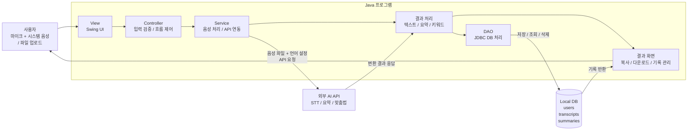

1. **프로젝트 구조 설계**
    
    o 프로젝트 기능 및 구성요소
    
    20개 기능 요구사항을 굵직한 **6개 기술 분야**로 묶었다. 이 구분은 그대로 자바 패키지 구조(`audio` / `api` / `db` / `ui` / `io` / `common`)와 이어지며, 비기능 요구사항의 “View / Controller / Service / DB 계층 분리”와도 자연스럽게 맞물린다.
    

| 기능 및 구성요소 | **포함 요구사항** | **핵심 기술 / 라이브러리** |
| --- | --- | --- |
| ① 오디오 캡처·재생 | F-01, F-02(파일 디코딩), F-09, F-10, F-11, F-14, F-18 | Java Sound API, Windows WASAPI loopback(JNI/JNA), 입력 장치 enumeration, 녹음 스레드, 일시정지/취소, 채널 분리 저장 |
| ② 외부 AI API 연동 | F-02(STT 호출), F-07, F-08 | [java.net](http://java.net).http.HttpClient, STT API(Whisper / Google STT 등), LLM API(요약·맞춤법·키워드), 다국어 옵션, 비동기 호출 |
| ③ 데이터베이스 (저장·관리) | F-04, F-05(삭제), F-12, F-15, F-16 | SQLite + JDBC, transcripts·summaries 테이블, DAO 패턴, CRUD, 검색·정렬·페이지네이션 SQL |
| ④ 사용자 인터페이스 (UI) | F-03, F-09(레벨 미터), F-10(시간 표시), F-12(편집 UI), 화면 전환·레이아웃 전반 | Swing, SwingWorker, EDT 관리, 진행바·상태 메시지, JFileChooser, JTable(기록 목록) |
| ⑤ 파일 입출력·내보내기 | F-05(다운로드), F-13 | [java.io](http://java.io) / java.nio, txt 저장, docx(Apache POI), srt 포맷 직접 작성 |
| ⑥ 공통 인프라 (인증·설정·예외·로그) | F-06, F-17, F-19, F-20 | 비밀번호 해시(BCrypt), 환경변수·설정 파일 로딩, API 키 보관, 글로벌 예외 핸들러, java.util.logging / slf4j |

o 프로젝트 화면  

https://github.com/user-attachments/assets/5844f264-493c-4cd7-b16e-a4b09c94bb95

o 주요 구성요소와 관계를 도식화(다이어그램)

#### 데이터베이스 설계 (ERD 요약)

| **테이블명** | **주요 컬럼** | **설명** |
| --- | --- | --- |
| users | id, name, email, password_hash, created_at | 로컬 로그인 사용자 정보 |
| transcripts | id, user_id, title, source_type, file_path, content, language, created_at | 변환된 텍스트 기록 |
| summaries | id, transcript_id, summary, keywords, created_at | 요약·키워드 등 부가 AI 처리 결과 |

1. **역할 분담**
    
    o 팀원별 담당 업무와 책임 범위
    

| **담당자** | **담당 업무** | **주요 작업** |
| --- | --- | --- |
| 민건영 (입력·API 담당) | F-01, F-02, F-07, F-08, F-09a, F-10, F-11, F-14 | 오디오 캡처(마이크·시스템 음성·동시 녹음·파일 업로드), 입력 장치 enumeration, 녹음 제어(일시정지·취소), 채널 라벨, STT API 호출 구조 — 그 위에 LLM API(요약·맞춤법·키워드)·다국어 옵션 재사용. "음성 → API → 결과" 입력측 일체. |
| 정의영 (팀장, 결과·UI·관리 담당) | F-03, F-04, F-05, F-06, F-09b, F-12, F-13, F-15, F-16, F-17, F-18, F-19, F-20 | 메인 Swing UI 골격·진행 상태·결과 표시·복사, 입력 레벨 미터, DB 저장·조회·검색·정렬, 결과 편집·재저장, 다양한 포맷 다운로드(.txt/docx/srt), 미리듣기, 회원가입·로그인·비밀번호 변경·탈퇴, 오류 알림·로그, 환경설정. "결과 → 화면·저장·내보내기" 출력측 일체. |
- **①·② (오디오 + 외부 API)** → 민건영 담당. "음성 입력 → STT/LLM API → 결과 수신" 데이터 흐름의 **입력측**을 한 명이 끝까지 책임진다. HttpClient·요청/응답 모델·에러 처리를 한 사람이 통제하므로 STT 위에 LLM(요약·맞춤법·키워드)을 얹을 때 코드 재사용이 자연스럽다.
- **③·④·⑤·⑥ (DB · UI · 파일 I/O · 공통)** → 정의영(팀장) 담당. 받은 결과를 화면에 보여주고, 저장하고, 내보내고, 안정적으로 동작하게 만드는 **출력측** 일체.
- 두 사람의 인터페이스는 공통 도메인 객체 `TranscriptResult { id, source, language, segments[], rawText, createdAt }`. Phase 0에서 형태를 합의하고 이후로는 거의 손대지 않는다.
- F-09는 **① 장치 enumeration(민건영)** 과 **④ 레벨 미터 UI(정의영)** 이 합쳐진 항목이라 이슈를 **F-09a / F-09b** 로 쪼개 진행한다.

o 협업 및 의사소통 방안 정리

팀즈와 notion을 활용하여 온라인에서 각자의 생각을 정리해서 올리고 수정을 하고 최종 정리된 완성본을 github에 올린다. 

1. **일정 관리 계획 및 세부 역할 분담**
    
    o 주차별 세부 일정 및 마일스톤 
    

민건영은 "음성 입력 → API 호출 → 결과 수신" 한 줄기를 처음부터 끝까지 책임지고, 정의영은 "결과 수신 → 화면·DB·내보내기" 한 줄기를 책임진다. 두 사람은 단계마다 공통 도메인 객체 `TranscriptResult`에서만 만나므로 의존성이 단방향이고 충돌이 적다. 일정은 총 **3주 단기 일정**(1주차: 2026-05-25~05-31, 2주차: 06-01~06-07, 3주차: 06-08~06-14)로 진행한다. 기존 6단계(Phase 0~6)를 3주차로 압축하면서, 우선순위가 낮은 부가 기능(테마/글꼴, 미리듣기, 로그인 등)은 여유 시간이 있을 때만 진행한다.

| **단계** | **기간** | **민건영 (입력·API)** | **정의영 (UI·저장·관리)** | **단계 끝 산출물** |
| --- | --- | --- | --- | --- |
| **1주차** — 셋업 + MVP "파일 → 텍스트" | 2026-05-25 ~ 05-31 | STT API 선정·키 발급, curl/Postman 응답 검증, HttpClient 통신 구조 구축, F-02 파일 업로드 → STT API 호출 → 텍스트 반환 Service 계층 구현 | 저장소·패키지 구조(`audio·api·db·ui·io·common`) 세팅, Swing 메인 창 골격, F-03 진행 상태·결과·복사 UI, F-19 오류 알림 UI, SQLite 연결·DB 스키마 초안 | 공통 도메인 객체 `TranscriptResult`/`RecordingSource` 합의 + **첫 시연** — 파일 넣고 텍스트 보기·복사 (학점 방어선) |
| **2주차** — 마이크 녹음 + 저장·내보내기 | 2026-06-01 ~ 06-07 | F-09a 입력 장치 enumeration, F-01 마이크 녹음 → STT, F-10 일시정지/재개, F-11 변환 취소 | F-04 DB 저장·목록 조회, F-05 .txt 다운로드·삭제, F-09b 레벨 미터 UI, F-03 녹음 시간·상태 표시, F-20 API 키 입력 UI | 마이크 녹음만으로 실시간 변환 가능 + 결과 SQLite 저장 + .txt 내보내기 |
| **3주차** — 시스템 음성·AI 부가·마무리·릴리스 | 2026-06-08 ~ 06-14 | F-01 시스템 음성 캡처(WASAPI loopback), 마이크+시스템 동시 녹음, F-14 채널 라벨, F-07 요약·맞춤법·키워드(LLM, 동일 HttpClient 재사용), F-08 다국어 옵션, API 재시도·타임아웃·오류 응답 안정화, 단위 테스트 | F-15 검색·필터링, F-12 결과 편집·재저장, F-13 docx/srt 다운로드, F-16 정렬·페이지네이션, F-18 미리듣기, F-06/F-17 로그인·탈퇴(여유 시), 릴리스 빌드 | **최종 시연** — 화상통화·온라인 강의 음성 변환 + 요약/자막 생성 + GitHub Releases에 실행 가능한 JAR 배포 |

o 중간 점검 계획 

수시로 팀즈와 notion을 활용하여 주차별 진행도 체크하고 의견을 교환하면서 중간 점검 한다.

| 점검 시점 | 핵심 목표 | 민건영 (입력·API) 점검 항목 | 정의영 (UI·저장·관리) 점검 항목 | 완료 기준(체크포인트) | 위험 요소 / 대응 |
| --- | --- | --- | --- | --- | --- |
| **1차 중간 점검** (1주차 종료, ~2026-05-31) | 환경 셋업 + MVP "파일 → 텍스트" |   • STT API 선정·키 발급- Postman/curl 응답 검증- HttpClient 통신 테스트- 파일 업로드 → STT Service 구현- 비동기 호출 기초 |   • Git 저장소·브랜치 전략- 패키지 구조 및 Swing 메인 프레임- 파일 선택·진행 상태·결과/복사 UI- 오류 팝업 UI- SQLite 연결 테스트 | ✔ STT 응답 JSON 수신 성공✔ 파일 업로드 → 텍스트 출력 성공✔ 첫 시연 가능 | API 응답 형식 변경 → DTO 분리 / 긴 음성 지연 → 비동기 처리(SwingWorker) |
| **2차 중간 점검** (2주차 종료, ~2026-06-07) | 마이크 녹음 + 저장·내보내기 |   • 입력 장치 enumeration- 마이크 녹음 → 실시간 STT 변환- 일시정지/재개/취소 구현 |   • SQLite 저장·기록 목록 조회- .txt 다운로드 및 삭제- 오디오 레벨 미터·녹음 시간 표시- API Key 입력 화면 | ✔ 마이크만으로 실시간 변환 가능✔ 변환 결과 DB 저장 + txt 내보내기 가능 | Java 오디오 장치 호환성 → 장치 fallback / DB 스키마 변경 → 공통 DTO 고정 |
| **최종 점검** (3주차 종료, ~2026-06-14) | 시스템 음성·AI 부가 + 안정화·배포 |   • WASAPI Loopback 시스템 음성 캡처- 마이크+시스템 동시 캡처·채널 라벨- 요약·맞춤법·키워드 LLM 연동- 다국어 STT 옵션- 재시도/타임아웃 처리 및 단위 테스트 |   • 검색/필터·정렬·페이지네이션 UI- 결과 편집 및 재저장- docx/srt 다운로드- 미리듣기- 릴리스 빌드 및 배포 | ✔ Zoom/강의 음성 시연 가능✔ 요약 결과 + 자막 파일 생성 성공✔ 통합 테스트 통과✔ 실행 가능한 JAR 배포 | Windows 의존성 → OS 범위 명시 / LLM 비용 → 호출 제한 / 배포 오류 → GitHub Releases 사용 |
