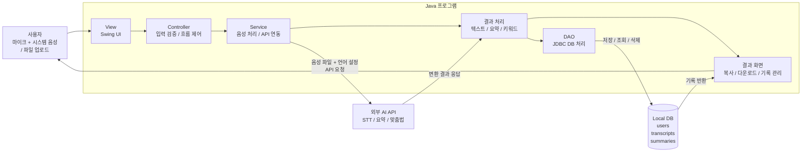

## 1. 요구사항 정의

### 기능적 요구사항

| **ID** | **요구사항** | **우선순위** |
| --- | --- | --- |
| F-01 | 마이크 음성 + 시스템 음성(스피커 출력) 동시 녹음 후 텍스트 변환 (화상통화 대응) | 높음 |
| F-02 | 음성 파일(mp3/wav) 업로드 후 텍스트 변환 | 높음 |
| F-03 | 변환 진행 상태 및 결과 텍스트 표시(복사 포함) | 높음 |
| F-04 | 변환 기록 DB 저장 및 목록 조회 | 중간 |
| F-05 | 저장 항목 다운로드/삭제 | 중간 |
| F-06 | 회원가입/로그인 (사용자별 기록 분리) | 낮음 |
| F-07 | 변환 텍스트 요약/맞춤법 교정/키워드 추출 | 낮음 |
| F-08 | 다국어(영어 등) 음성 인식 | 낮음 |

### 비기능적 요구사항

- **성능**: 1분 이내 음성 파일은 30초 이내 변환 완료 목표
- **사용성**: 사용 설명서 없이 메인 화면에서 3-클릭 이내 변환 가능
- **호환성**: JRE 17 이상이 설치된 Windows / macOS / Linux 지원 (시스템 음성 캡처는 OS별 대응 입력 장치 사용: Windows WASAPI loopback / macOS BlackHole 등 가상 장치 / Linux PulseAudio monitor)
- **배포성**: GitHub Releases에 단일 JAR 파일로 배포, 별도 설치 과정 불필요
- **보안**: API 키는 소스코드에 포함하지 않고 환경변수·설정 파일로 분리, 비밀번호는 해시 저장
- **유지보수성**: View / Controller / Service / DB 계층 분리로 기능 추가 용이
- **안정성**: 네트워크 오류·잘못된 파일 형식 입력 시 프로그램 종료 없이 오류 메시지 표시

## 2. 시스템 설계

### 아키텍처 다이어그램



### 데이터베이스 설계 (ERD 요약)

| **테이블명** | **주요 컬럼** | **설명** |
| --- | --- | --- |
| users | id, name, email, password_hash, created_at | 로컬 로그인 사용자 정보 |
| transcripts | id, user_id, title, source_type, file_path, content, language, created_at | 변환된 텍스트 기록 |
| summaries | id, transcript_id, summary, keywords, created_at | 요약·키워드 등 부가 AI 처리 결과 |

### 화면 설계 (Wireframe)

- **메인 화면**: 입력 소스 선택(마이크 / 시스템 음성 / 둘 다), 녹음 버튼, 파일 업로드 영역, 변환 시작/중지 버튼, 결과 텍스트 영역, 복사 버튼
- **로그인 / 회원가입 화면**: 이메일·비밀번호 입력, 가입/로그인 전환
- **기록 목록 화면**: 날짜·시간순 변환 기록 리스트, 항목별 요약·복사·다운로드·삭제 버튼
- **상세 화면**: 선택한 변환 결과의 전체 텍스트, 요약·키워드 영역

> 도구 예시: Figma, Kakao Oven, 직접 스케치 후 사진 첨부
> 

## 3. GitHub Issues로 요구사항 관리

### 이슈 등록 절차

1. 저장소 → `Issues` 탭 → `New issue` 클릭
2. 제목(Title): 요구사항 또는 기능 이름
3. 본문(Description): 세부 설명, 완료 조건 작성
4. Label 지정: `feature`, `bug`, `enhancement` 등
5. Assignee 지정: 담당자 연결

### 예시 이슈 구조

```
제목: [F-02] 음성 파일 업로드 후 텍스트 변환
라벨: feature
담당자: 정의영
본문:
 - 구현 내용: 파일 선택 UI → STT API 요청 → 결과 텍스트 표시
 - 완료 조건: 샘플 음성 파일 입력 시 변환 텍스트가 화면에 출력됨
```

### 담당자별 이슈 분배

| **담당자** | **담당 이슈 ID** | **주요 작업** |
| --- | --- | --- |
| 정의영 (팀장) | F-01, F-02, F-03, F-08 | 메인 UI, 마이크 + 시스템 음성 동시 녹음 · 파일 업로드, STT API 연동, 다국어 옵션 |
| 민건영 | F-04, F-05, F-06, F-07 | DB 설계 및 변환 기록 저장·관리, 회원가입/로그인, 요약·맞춤법·키워드 API 연동, 통합 테스트 |