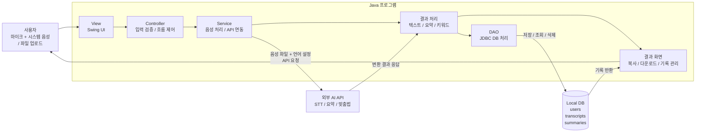

# 요구사항 및 시스템 설계

## 1. 요구사항 정의

### 기능적 요구사항

| **ID** | **요구사항** | **우선순위** |
| --- | --- | --- |
| F-01 | 마이크 음성 + 시스템 음성(스피커 출력) 동시 녹음 후 텍스트 변환 (화상통화 대응) | 높음 |
| F-02 | 음성 파일(mp3/wav) 업로드 후 텍스트 변환 | 높음 |
| F-03 | 변환 진행 상태 및 결과 텍스트 표시(복사 포함) | 높음 |
| F-04 | 변환 기록 DB 저장 및 목록 조회 | 높음 |
| F-05 | 저장 항목 다운로드/삭제 | 높음 |
| F-06 | 회원가입/로그인 (사용자별 기록 분리) | 낮음 |
| F-07 | 변환 텍스트 요약/맞춤법 교정/키워드 추출 | 낮음 |
| F-08 | 다국어(영어 등) 음성 인식 | 낮음 |
| F-09 | 입력 장치(마이크/시스템 음성) 선택 및 실시간 입력 레벨 표시 | 높음 |
| F-10 | 녹음 일시정지/재개 및 녹음 경과 시간 표시 | 중간 |
| F-11 | 진행 중인 변환 작업 취소(Cancel) 처리 | 중간 |
| F-12 | 변환 결과 텍스트 편집(수정 후 재저장) | 중간 |
| F-13 | 변환 결과 다양한 형식 다운로드 (txt / docx / srt 자막) | 중간 |
| F-14 | 화자(채널) 구분 표시 — 마이크 음성 / 시스템 음성 라벨링 | 중간 |
| F-15 | 변환 기록 검색·필터링 (제목·날짜·키워드) | 중간 |
| F-16 | 변환 기록 정렬(최신순·제목순) 및 페이지 단위 조회 | 낮음 |
| F-17 | 비밀번호 변경 및 회원 탈퇴 | 낮음 |
| F-18 | 변환 전 음성 파일 미리듣기 (재생·일시정지·탐색) | 낮음 |
| F-19 | 오류 발생 시 사용자 친화적 알림 및 오류 로그 파일 저장 | 높음 |
| F-20 | 환경설정 화면 — API 키 입력·보관(필수), 테마·글꼴 크기(부가) | 높음 |

### 비기능적 요구사항

- **성능**: 1분 이내 음성 파일은 30초 이내 변환 완료 목표
- **사용성**: 사용 설명서 없이 메인 화면에서 3-클릭 이내 변환 가능
- **호환성**: JRE 17 이상이 설치된 Windows / macOS / Linux 지원 (시스템 음성 캡처는 OS별 대응 입력 장치 사용: Windows WASAPI loopback / macOS BlackHole 등 가상 장치 / Linux PulseAudio monitor)
- **배포성**: GitHub Releases에 단일 JAR 파일로 배포, 별도 설치 과정 불필요
- **보안**: API 키는 소스코드에 포함하지 않고 환경변수·설정 파일로 분리, 비밀번호는 해시 저장
- **유지보수성**: View / Controller / Service / DB 계층 분리로 기능 추가 용이
- **안정성**: 네트워크 오류·잘못된 파일 형식 입력 시 프로그램 종료 없이 오류 메시지 표시

## 2. 시스템 설계

### 아키텍처 다이어그램

### 데이터베이스 설계 (ERD 요약)

| **테이블명** | **주요 컬럼** | **설명** |
| --- | --- | --- |
| users | id, name, email, password_hash, created_at | 로컬 로그인 사용자 정보 |
| transcripts | id, user_id, title, source_type, file_path, content, language, created_at | 변환된 텍스트 기록 |
| summaries | id, transcript_id, summary, keywords, created_at | 요약·키워드 등 부가 AI 처리 결과 |

### 화면 설계 (Wireframe)

https://github.com/user-attachments/assets/5844f264-493c-4cd7-b16e-a4b09c94bb95

> (최종 결과물과 다를 수 있음)

## 3. GitHub Issues로 요구사항 관리

### 이슈 라벨(Labels)
- `feature`: 신규 기능
- `enhancement`: 기능 개선/확장(기본 기능 위에 얹는 것)
- `bug`: 오류 수정
- `ui`: Swing 화면/UX 중심
- `audio`: 녹음/입력장치/재생
- `api`: STT/LLM 외부 API 연동
- `db`: SQLite/JDBC/DAO/쿼리
- `export`: txt/docx/srt 내보내기
- `auth`: 로그인/회원/보안
- `settings`: 환경설정(API 키/테마 등)
- `error-handling`: 예외/로그/에러 UX
- `priority:high` | `priority:mid` | `priority:low`

### 담당자별 이슈 분배

| **담당자** | **담당 이슈 ID** | **주요 작업** |
| --- | --- | --- |
| 민건영 (입력·API 담당) | F-01, F-02, F-07, F-08, F-09a, F-10, F-11, F-14 | 오디오 캡처(마이크·시스템 음성·동시 녹음·파일 업로드), 입력 장치 enumeration, 녹음 제어(일시정지·취소), 채널 라벨, STT API 호출 구조 — 그 위에 LLM API(요약·맞춤법·키워드)·다국어 옵션 재사용. "음성 → API → 결과" 입력측 일체. |
| 정의영 (팀장, 결과·UI·관리 담당) | F-03, F-04, F-05, F-06, F-09b, F-12, F-13, F-15, F-16, F-17, F-18, F-19, F-20 | 메인 Swing UI 골격·진행 상태·결과 표시·복사, 입력 레벨 미터, DB 저장·조회·검색·정렬, 결과 편집·재저장, 다양한 포맷 다운로드(.txt/docx/srt), 미리듣기, 회원가입·로그인·비밀번호 변경·탈퇴, 오류 알림·로그, 환경설정. "결과 → 화면·저장·내보내기" 출력측 일체. |

---

## 4. 분야별 요구사항 정리

20개 기능 요구사항을 굵직한 **6개 기술 분야**로 묶었다. 이 구분은 그대로 자바 패키지 구조(`audio` / `api` / `db` / `ui` / `io` / `common`)와 이어지며, 비기능 요구사항의 “View / Controller / Service / DB 계층 분리”와도 자연스럽게 맞물린다.

| **분야** | **포함 요구사항** | **핵심 기술 / 라이브러리** |
| --- | --- | --- |
| ① 오디오 캡처·재생 | F-01, F-02(파일 디코딩), F-09, F-10, F-11, F-14, F-18 | Java Sound API, Windows WASAPI loopback(JNI/JNA), 입력 장치 enumeration, 녹음 스레드, 일시정지/취소, 채널 분리 저장 |
| ② 외부 AI API 연동 | F-02(STT 호출), F-07, F-08 | [java.net](http://java.net).http.HttpClient, STT API(Whisper / Google STT 등), LLM API(요약·맞춤법·키워드), 다국어 옵션, 비동기 호출 |
| ③ 데이터베이스 (저장·관리) | F-04, F-05(삭제), F-12, F-15, F-16 | SQLite + JDBC, transcripts·summaries 테이블, DAO 패턴, CRUD, 검색·정렬·페이지네이션 SQL |
| ④ 사용자 인터페이스 (UI) | F-03, F-09(레벨 미터), F-10(시간 표시), F-12(편집 UI), 화면 전환·레이아웃 전반 | Swing, SwingWorker, EDT 관리, 진행바·상태 메시지, JFileChooser, JTable(기록 목록) |
| ⑤ 파일 입출력·내보내기 | F-05(다운로드), F-13 | [java.io](http://java.io) / java.nio, txt 저장, docx(Apache POI), srt 포맷 직접 작성 |
| ⑥ 공통 인프라 (인증·설정·예외·로그) | F-06, F-17, F-19, F-20 | 비밀번호 해시(BCrypt), 환경변수·설정 파일 로딩, API 키 보관, 글로벌 예외 핸들러, java.util.logging / slf4j |

### 담당과의 매핑 메모

- **①·② (오디오 + 외부 API)** → 민건영 담당. "음성 입력 → STT/LLM API → 결과 수신" 데이터 흐름의 **입력측**을 한 명이 끝까지 책임진다. HttpClient·요청/응답 모델·에러 처리를 한 사람이 통제하므로 STT 위에 LLM(요약·맞춤법·키워드)을 얹을 때 코드 재사용이 자연스럽다.
- **③·④·⑤·⑥ (DB · UI · 파일 I/O · 공통)** → 정의영(팀장) 담당. 받은 결과를 화면에 보여주고, 저장하고, 내보내고, 안정적으로 동작하게 만드는 **출력측** 일체.
- 두 사람의 인터페이스는 공통 도메인 객체 `TranscriptResult { id, source, language, segments[], rawText, createdAt }`. Phase 0에서 형태를 합의하고 이후로는 거의 손대지 않는다.
- F-09는 **① 장치 enumeration(민건영)** 과 **④ 레벨 미터 UI(정의영)** 이 합쳐진 항목이라 이슈를 **F-09a / F-09b** 로 쪼개 진행한다.
