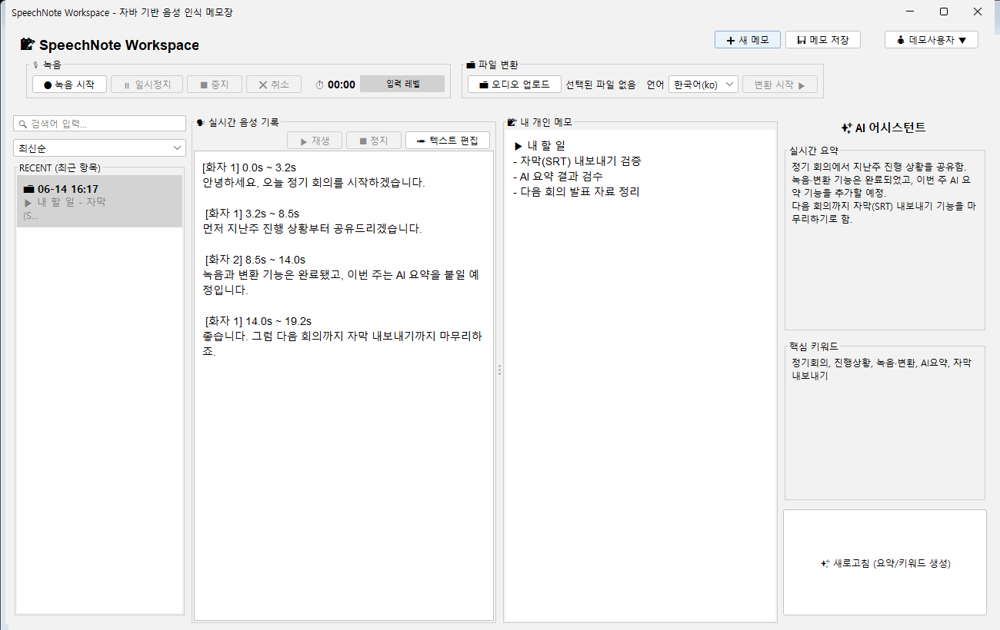

<!-- _class: lead -->
<!-- _paginate: false -->

# 🎙 SpeechNote

## 마이크와 시스템 음성을 함께 기록하는 AI 음성 메모장

**민건영**  |  2026 프로젝트 발표

---

## 발표 순서

<div class="cols">
<div>

**1. 배경과 목표**
- 문제 정의 · 동기
- 목표와 범위

**2. 요구사항·설계**
- 요구사항 분석
- 기술 선택 근거
- 아키텍처 · DB 설계

</div>
<div>

**3. 구현**
- 프로젝트 구조 · 추적성
- 핵심 구현 · 기술적 난제

**4. 동작·과정**
- 데모 · 테스트 · 배포 · 개발 과정

**5. 마무리**
- 구현 현황 · 회고 · 결론

</div>
</div>

---

<!-- _class: lead -->

# 1. 배경과 목표


---

## 문제 정의 & 동기

<div class="cols">
<div>

### 🔴 현실의 불편함
- 화상회의·온라인 강의 내용을 **사람이 일일이 받아 적어야** 함
- 받아 적다 보면 **내용에 집중 못 함**
- 끝나면 누가 무슨 말을 했는지 흐릿함

### ⚠️ 기존 도구의 한계
- 특정 회의 플랫폼에 **종속**
- 보통 **내 마이크 목소리만** 기록 → 상대방(스피커) 음성은 놓침

</div>
<div>

### 🟢 우리의 접근
- **마이크 + 시스템(스피커) 음성을 동시에** 캡처
- 변환 결과를 **내 PC에 저장**하고 자유롭게 가공
- **AI 요약·키워드**로 핵심만 빠르게 파악

<div class="why">
<b>한 줄 정리</b><br>
"플랫폼에 묶이지 않고, 양쪽 목소리를 모두 기록해, 요약까지 해주는 내 노트"
</div>

</div>
</div>

---

## 목표와 범위 (Scope)

<div class="cols">
<div>

### 🟢 In-Scope
- 마이크·시스템 **동시 녹음**
- 오디오 파일 업로드 변환
- 기록 **DB 저장·검색·정렬**
- TXT / DOCX / SRT **내보내기**
- 회원가입·로그인 (사용자별 분리)
- **AI 요약·키워드**

</div>
<div>

### 🔴 Out-of-Scope
- 실시간 스트리밍 변환
- 다중 기기 동기화(중앙 DB 서버)
- 고급 보안(salt · 2FA)
- 모바일 앱

</div>
</div>

---

<!-- _class: lead -->

# 2. 요구사항·설계


---

## 요구사항 분석 (기능 20개, F-01 ~ F-20)

<div class="cols">
<div class="small">

| ID | 기능 | 우선 |
| --- | --- | --- |
| F-01 | 실시간 녹음·장치 선택 | 높음 |
| F-02 | 오디오 파일 업로드 | 높음 |
| F-03 | 커스텀 STT API | 높음 |
| F-05 | 비동기·프로그레스 | 높음 |
| F-06 | 회원가입·로그인 | 높음 |
| F-07 | SQLite DB 연동 | 높음 |
| F-13 | 핵심 요약 | 중간 |
| F-14 | 키워드 추출 | 중간 |
| F-19 | 전역 에러 로깅 | 높음 |
| F-20 | Two-Split UI | 높음 |

</div>
<div class="small">

| ID | 기능 | 우선 |
| --- | --- | --- |
| F-08 | 히스토리 패널 | 중간 |
| F-09 | 우클릭 메뉴 | 중간 |
| F-10 | TXT 내보내기 | 중간 |
| F-11 | DOCX·SRT 내보내기 | 중간 |
| F-12 | STT 원문 편집 | 중간 |
| F-15 | 실시간 통합 검색 | 중간 |
| F-16 | 목록 정렬 | 낮음 |
| F-17 | 계정 관리(변경·탈퇴) | 낮음 |
| F-18 | 오디오 미니 플레이어 | 낮음 |
| F-04 | 설정·구성 관리 | 낮음 |

</div>
</div>

---

## 비기능 요구사항 & 기술 선택 근거

<div class="cols">
<div>

### 비기능 요구사항
- **성능**: 1분 음성 → 30초 내 변환
- **사용성**: 3-클릭 내 변환
- **안정성**: 오류 시 종료 없이 안내
- **보안**: 키 분리, 비번 해시
- **배포성**: 단일 JAR, 설치 불필요

</div>
<div class="small">

### 왜 이 기술인가
| 기술 | 선택 이유 |
| --- | --- |
| **Java 11 / Swing** | 추가 런타임 없이 크로스플랫폼 GUI, Java Sound로 오디오 캡처 가능 |
| **SQLite** | 서버 불필요, 파일 1개로 동작 → 로컬 앱에 최적 |
| **외부 STT/LLM API** | LLM 모델을 직접 추론할 수 없으니 검증된 API에 집중 |
| **Maven + shade** | 의존성 관리 + 단일 실행 JAR 패키징 |
| **FlatLaf / POI** | 현대적 UI / DOCX 문서 생성 |

</div>
</div>

---

## 시스템 아키텍처 (계층 분리)

<div class="flow">

```
[사용자] 마이크+시스템 / 파일 업로드
   │
   ▼
[ View · Swing UI ] ──▶ [ 입력 검증 · 흐름 제어 ]
   │                          │
   │                          ▼
   │                   [ Service · 음성 처리/API 연동 ] ──▶ [외부 AI API]
   │                          │                              STT · LLM 요약
   │                          ▼                                  │
   └──◀── [ 결과 처리: 텍스트/요약/키워드 ] ◀──────────────────────┘
                  │                  │
                  ▼                  ▼
          [ 결과 화면 ]        [ DAO · JDBC ] ──▶ [Local SQLite]
       복사/다운로드/관리                      users · transcripts · segments
```

</div>

**핵심 원칙**: UI ↔ Service ↔ API/DAO를 **단방향 의존**으로 분리 → 한 곳을 고쳐도 다른 곳에 영향 최소화

---

## 데이터베이스 설계 (ERD)

<div class="cols">
<div class="small">

`users (1) ──< transcripts (1) ──< segments`

| 테이블 | 핵심 컬럼 |
| --- | --- |
| **users** | id(PK), username(UQ), password_hash |
| **transcripts** | id(PK), **user_id(FK)**, source, raw_text, summary, keywords, memo, audio_path, created_at |
| **segments** | id(PK), **transcript_id(FK)**, start_sec, end_sec, speaker, content |

</div>
<div>

### 핵심 설계 결정
- **1:N 관계** — 회원 1명 ↔ 기록 N개 ↔ 구간 N개
- **UUID 기본 키** — 분산·병합에 안전한 고유 ID
- **ON DELETE CASCADE** — 회원 탈퇴 시 하위 데이터 자동 정리
- **트랜잭션 저장** — 본문+구간을 원자적으로 (실패 시 롤백)
- **파라미터 바인딩** — SQL 인젝션 방지

</div>
</div>

---

## 화면 설계 (UI 구성도)

<div class="small">

```
┌─ SpeechNote Workspace ───────────── [➕새 메모][💾저장][👤사용자] ─┐
│ 🎙 녹음 [시작][⏸][중지][취소] ⏱00:00 레벨▮▮▯ │ 📁 [업로드][언어▼][▶변환] │
├─────────┬────────────────────┬───────────────────┬────────────────┤
│ RECENT  │ 🗣 실시간 음성 기록 │ 📝 내 개인 메모    │ ✨ AI 어시스턴트 │
│ 🔍 검색 │ [STT 원문·세그먼트] │ [메모 입력·자동저장] │  실시간 요약   │
│ 정렬 ▼  │ ▶재생 ⏹정지 ✏️편집 │                   │  핵심 키워드   │
│ • 기록1 │                    │                   │  [✨ 새로고침] │
│ • 기록2 │                    │                   │                │
└─────────┴────────────────────┴───────────────────┴────────────────┘
   좌: 히스토리      중앙: Two-Split (음성 기록 ↔ 개인 메모)      우: AI 패널
```

</div>

- **로그인/회원가입 창**, **환경설정 창**(오디오 장치 · API URL/Key)은 별도 모달
- 좌(목록) · 중(STT ↔ 메모 Two-Split) · 우(AI) **3분할 컨트롤**


---

<!-- _class: lead -->

# 3. 구현

---

## 프로젝트 구조 & 요구사항 추적성

<div class="cols">
<div class="small">

```
src/main/java/
├── SpeechNoteApp.java  # 진입점
├── audio/    녹음·장치
├── api/      STT·LLM 통신
├── service/  변환·인증·내보내기
├── db/       DB 접근(DAO)
├── ui/       Swing 화면
└── common/   모델·설정·예외·로깅
```

</div>
<div class="small">

| 패키지 | 요구사항 | 핵심 기술 |
| --- | --- | --- |
| `audio` | F-01,02 | Java Sound, 채널 분리 |
| `api` | F-03,13,14 | HttpClient, 비동기·재시도 |
| `service` | F-05,06,10,11,17 | 파이프라인·인증·POI |
| `db` | F-07,12,15,16 | JDBC, 트랜잭션, CASCADE |
| `ui` | F-08,09,18,20 | Swing, SwingWorker |
| `common` | F-04,19 | 설정·모델·로깅 |

</div>
</div>

<div class="why">
<b>추적성</b>: 모든 요구사항(F-01~20)이 특정 패키지·소스 파일과 1:1로 연결됨 → "요구사항이 실제로 구현됐는가"를 코드로 증명
</div>

---

## 핵심 구현 ① 입력 → 변환 파이프라인

<div class="cols">
<div>

**🎙 녹음 (F-01)**
- 마이크 + 시스템 두 라인을 **동시에** 읽어 2채널로 저장 → 16kHz WAV
- 실시간 입력 레벨(RMS) 미터, 일시정지·취소

**📤 STT 통신 (F-03)**
- multipart로 음성 파일 전송
- **재시도 + 타임아웃** 적용

</div>
<div>

**⚙️ 비동기 처리 (F-05)**
- `CompletableFuture` / `SwingWorker`로 백그라운드 변환
- 진행바·상태 메시지, **취소 가능**

**🧩 결과 모델**
- 응답을 `TranscriptResult`(원문 + 시간대별 `segment[]`)로 파싱
- 화면·DB·내보내기에서 공통 사용

</div>
</div>

---

## 핵심 구현 ② 관리 · AI · 내보내기

<div class="cols">
<div>

**🗂 기록 관리**
- 사용자별 기록 분리, 좌측 히스토리 패널
- **실시간 통합 검색**(메모·원문·요약·키워드) + 정렬
- 우클릭 메뉴(복사·내보내기·삭제)
- **메모 자동 저장** (입력 멈춤 시 저장·이탈 시 flush)

</div>
<div>

**✨ AI 어시스턴트 (F-13·14)**
- LLM으로 **3줄 요약 + 키워드 5개** 추출

**📦 내보내기 (F-10·11)**
- **TXT** (원문+메모+요약)
- **SRT** 자막 (타임코드·화자)
- **DOCX** 문서 (Apache POI)

</div>
</div>

---

## 기술적 난제와 해결

<div class="cols3 small">
<div class="box">

**① 시스템(스피커) 음성 캡처**
OS가 기본 제공하지 않음
→ **VB-CABLE 가상 장치**로 루프백, 마이크와 **2채널 동시 녹음** 후 합성

</div>
<div class="box">

**② 깨지거나 잘린 STT 응답**
JSON이 중간에 끊겨 옴
→ **정규식 fallback 파싱**으로 세그먼트 복구(`SttResponse`) → 죽지 않고 결과 표시

</div>
<div class="box">

**③ 긴 작업 중 UI 멈춤·메모 유실**
→ **비동기 + 취소** 처리, 메모는 **디바운스 자동 저장 + 이탈 시 flush**로 안전 보장

</div>
</div>

<div class="why">
"되게 만들기"를 넘어 <b>안 될 때를 대비</b>한 설계 — 네트워크 오류·깨진 응답·중도 취소에도 앱이 죽지 않음<br>
학습 수준에 맞으면서도 <b>도전적인 요소(시스템 음성·비동기·복구 파싱)를 완성도 있게 마무리</b> → 난이도와 완성도의 균형
</div>

---

<!-- _class: lead -->

# 4. 동작·과정


---

## 데모 — 실제 동작 화면

**시연 흐름**:&nbsp; ① 로그인 → ② 파일 업로드·**변환** → ③ 기록 검색 → ④ **AI 요약·키워드** → ⑤ 메모(자동 저장) → ⑥ **DOCX/SRT 내보내기**

<div style="text-align:center">



</div>

---

## 테스트 & 최적화

<div class="cols">
<div>

### ✅ 검증 방법
- **JUnit 단위 테스트 11개** (`mvn test`)
  STT 응답 파싱 · 예외 메시지 변환 · SRT 내보내기 자동 검증
- `Demo.java` 콘솔로 **STT 연동 단독 검증**
- **정상/비정상 시나리오 수동 점검**
  (네트워크 끊김 · 잘못된 파일 · 중도 취소 · 잘못된 키 → 종료 없이 안내)

</div>
<div>

### ⚡ 최적화 · 안정성
- segments **배치 INSERT**로 저장 성능↑
- 오디오 **16kHz 다운샘플**로 전송량↓
- API **재시도 + 타임아웃**
- **전역 에러 로깅** (`logs/error.log`)
- 사용자별 기록 분리 검증

</div>
</div>

---

## 빌드 · 배포 · 산출물

<div class="cols">
<div>

### 🛠 빌드 & 실행
```bash
mvn clean package
java -jar \
  target/SpeechNote-1.0-SNAPSHOT.jar
```
- **maven-shade-plugin**으로 의존성 포함 **단일 JAR**
- **GitHub Releases**에 업로드 → 설치 없이 실행

</div>
<div>

### 📄 프로젝트 산출물
- **README** — 소개·기술스택·실행법·구조·VB-CABLE 안내
- **.gitignore** — `target/`, `config.properties`(API 키), `*.db`, `logs/` 제외
- **docs/** — 0~4·9 설계 문서 + 발표 슬라이드
- **GitHub Issues** — 요구사항 추적

</div>
</div>

<div class="why">
API 키·로컬 DB 등 <b>민감/생성 파일은 커밋 제외</b> → 보안 + 저장소 청결
</div>

---

## 개발 과정 · Git · 일정

<div class="cols">
<div class="small">

### 🧩 개발 방식 (1인 개발)
계층 분리로 영역별로 독립 개발하고, 공통 객체 `TranscriptResult`로 연결

| 영역 | 패키지 |
| --- | --- |
| 입력·오디오·API | `audio` · `api` |
| 화면(UI) | `ui` |
| 저장·변환·인증 | `db` · `service` |
| 공통(모델·설정·로깅) | `common` |

### 🔀 Git 프로세스
기능별 브랜치 · `<type>: <subject>` 커밋 규칙 · **GitHub Issues**로 요구사항(F-01~20) 추적

</div>
<div class="small">

### 📅 일정 (WBS, 3주)
| 주차 | 산출물 |
| --- | --- |
| 1주 (5/25~31) | MVP: 파일→텍스트, DB 스키마 |
| 2주 (6/1~7) | 녹음→변환→저장, 히스토리·TXT |
| 3주 (6/8~14) | 시스템음성·AI·검색·DOCX/SRT·로그인·배포 |

중간 점검 ①STT변환 ②녹음·저장 ③최종 통합·배포

</div>
</div>

---

<!-- _class: lead -->

# 5. 마무리

## 현황 · 회고 · 결론

---

## 구현 현황 요약

<div class="cols">
<div>

<p class="big">20 / 20</p>

**요구사항 100% 구현 완료**

- ✅ 완성 20 · 🔶 부분 0 · ❌ 미완 0

</div>
<div>

### 목표 → 결과 일치
- 초기 목표(마이크+시스템 캡처 · 로컬 보관 · AI 요약)를
  **결과물이 모두 달성**
- **계획(WBS) 대비 구현 범위 100%** 달성
- 핵심→부가 기능이 **하나의 사용 흐름**으로
  연결된 **실사용 수준 완성도**

</div>
</div>

---

## 회고 — 잘된 점과 한계

<div class="cols">
<div>

### 👍 잘된 점
- **계층 분리** 설계 → 유지보수·확장 용이
- **견고함**: 재시도·타임아웃·트랜잭션·fallback 파싱
- 오류에도 **죽지 않는** 안정성
- 요구사항 **추적성** 확보

</div>
<div>

### 🔧 한계 & 개선 방향
- **① 실시간 전사 미구현**
  일괄 처리 → *WebSocket 스트리밍 STT*로 발화와 동시 자막
- **② 로컬 DB 한계**
  단일 PC 종속 → *중앙 DB/백엔드*로 다중 기기·백업·공유

</div>
</div>

---

<!-- _class: lead -->
<!-- _paginate: false -->

# 감사합니다 🙏

## SpeechNote — 마이크와 시스템 음성을 함께 기록하는 AI 메모장

**민건영**
github.com/jeyman2003-debug/SpeechNote

### 질문 환영합니다
